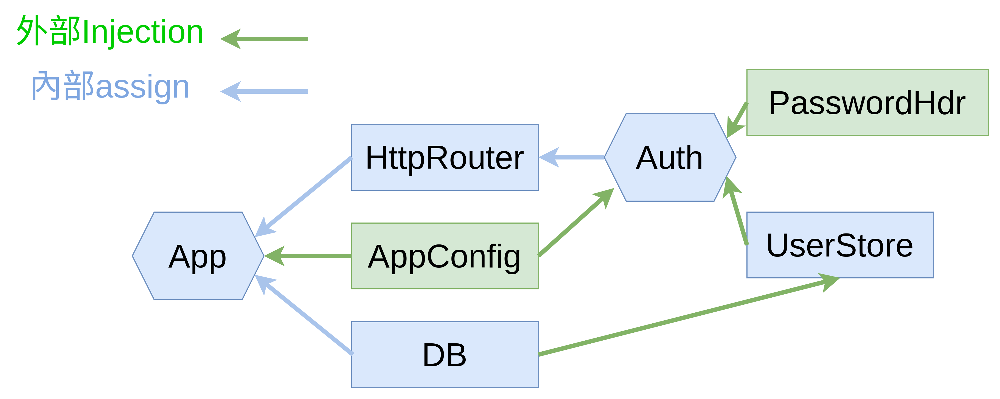

# golang-finance-api

This is sample of how to structure my golang restful api server

## structure

1. cmd 
  
  This folder is for executable package main with func main

2. internal 

  This folder is for internal implementation not output as package

3. pkg 
   
  This folder is for ouptut as package

## for service purpose

透過把相同職責的元件放到同一個 service 資料夾 folder 下

比如這邊放在 service/auth 下的 go 檔案都是與操作 auth 相關

然後再根據不同的處理範圍分別取名不同，比如是處理 jwt 則放 jwt.go

處理網路請求路由則放 router.go

## pkg

此資料夾用來放置可以開發對外使用的 library

比如這邊是針對 password 的操作

## dependency-graph

## injection direction graph

